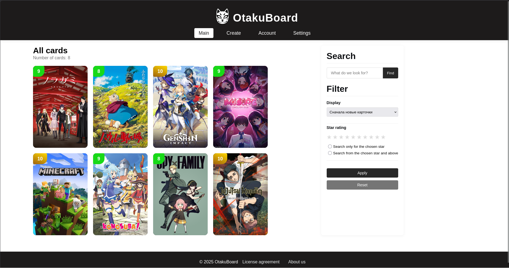

<p align="center">
  
</p>
<h1 align="center">OtakuBoard</h1>

<p align="center">
  Personal media tracker for your digital experience
</p>

---

🇷🇺 Русская версия: [README.ru.md](README.ru.md)

---

## 📌 About

**OtakuBoard** is a desktop web-based application for collecting and organizing digital content in the form of customizable cards.

It allows you to track what you have watched, read, or played, and store it in a structured, visual way — all data is saved locally on your device.

OtakuBoard helps you turn your digital experiences into a personal collection of achievements.

---

## ✨ Features

- 🗂 Create and customize media cards
- 🎬 Track anime, movies, TV series, books, music, and games
- ⭐ Rating system for personal evaluation
- 📝 Notes and descriptions for each entry
- 🔍 Powerful search system with slash commands
- 📁 Fully local storage (SQLite)
- 🔒 No cloud, no accounts — full data ownership
- 🖥 Desktop support (Windows / Linux)
- ⚡ Lightweight web interface (Eel backend)

---

## 🧠 Concept

OtakuBoard is a personal media tracker that helps you build a structured record of your digital experience.

Log what you watch, read, or play, add ratings and notes, and organize everything into elegant, easy-to-browse cards — with your data fully under your control and stored locally on your device.

---

## ⚙️ Technologies

- Python (backend logic)
- JavaScript (frontend UI)
- HTML / CSS (interface)
- Eel (Python ↔ JavaScript bridge)
- SQLite (local database storage)
- Desktop application (Windows / Linux)

---

## 🔎 Search Commands

| Command        | Alias | Description                |
| -------------- | ----- | -------------------------- |
| `/id`          | —     | Search by unique card ID   |
| `/name`        | `/n`  | Search by title or name    |
| `/author`      | `/a`  | Search by author / creator |
| `/genre`       | `/g`  | Search by genre            |
| `/year`        | `/y`  | Search by release year     |
| `/type`        | `/t`  | Search by media type       |
| `/link`        | `/l`  | Search by external link    |
| `/description` | `/d`  | Search inside descriptions |
| `/star`        | `/s`  | Search by rating           |
| `/cover`       | `/c`  | Search by cover image      |

---

## 💾 Installation

### Windows

1. Download the latest release from GitHub Releases
2. Extract the archive
3. Run:

```bash
OtakuBoard.exe
```

### Linux

1. Download the latest release
2. Extract archive
3. Make executable:

```
chmod +x OtakuBoard
```

4. Run application:

```
./OtakuBoard
```

---

## 📸 Screenshots

<p align="center">
  
</p>
<p align="center">
  OtakuBoard Main Screen
</p>

A dashboard for managing your personal media collection (anime, games). The screen displays a grid of saved titles with personal ratings, as well as a search bar and flexible filtering options by rating and newness.

---

## 🚀 Upcoming Features (Roadmap)

Here are some of the exciting optional features and enhancements planned for future releases:

- [ ] **In-Card Digital Content Storage:** Allow users to attach and store digital content directly within individual cards.

- [ ] **In-App Feedback System:** Implement a built-in mechanism for users to easily share feedback, suggestions, or report issues directly from the app.

- [ ] **Card Grouping:** Introduce the ability to organize and group cards together (core logic implementation in `dataManager.py`).
  
- [ ] **Localization (English Support):** Expand accessibility by adding a full English translation to the application interface.
  
- [ ] **In-App Updates:** Add a convenient feature in the settings menu to check for and install application updates directly.
  
- [ ] **Customizable Card Designs:** Provide users with options to switch between different visual themes and layouts for their cards.
  
- [ ] **Persistent Search & Filters:** Automatically save the state of search queries and active filters on the list page (`list-page.html`) so users don't lose their context during navigation.

---
