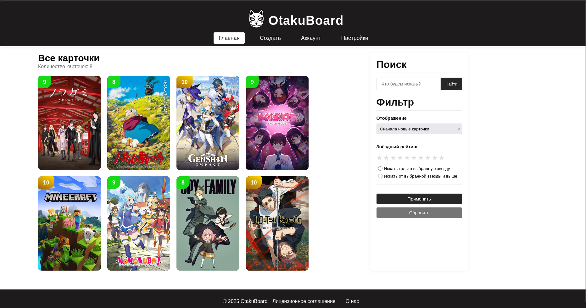

<p align="center">
  
</p>
<h1 align="center">OtakuBoard</h1>

<p align="center">
  Персональный медиа трекер для твоего цифрового опыта
</p>

---

🇬🇧 English version: [README.md](README.md)

---

## 📌 О проекте

OtakuBoard — это десктопное веб-приложение для сбора и организации цифрового контента в виде настраиваемых карточек.

Приложение позволяет отслеживать, что ты посмотрел, прочитал или прошёл, и хранить это в структурированном визуальном виде — все данные сохраняются локально на устройстве.

OtakuBoard помогает превратить твой цифровой опыт в персональную коллекцию достижений.

---

## ✨ Возможности

🗂 Создание и настройка медиа-карточек  
🎬 Отслеживание аниме, фильмов, сериалов, книг, музыки и игр  
⭐ Система оценок для личного использования  
📝 Заметки и описания для каждой записи  
🔍 Мощный поиск с поддержкой slash-команд  
📁 Полностью локальное хранение (SQLite)  
🔒 Без облака и аккаунтов — полный контроль над данными  
🖥 Поддержка десктопа (Windows / Linux)  
⚡ Лёгкий веб-интерфейс (Eel backend)

---

## 🧠 Концепция

OtakuBoard — это персональный медиа трекер, который помогает тебе структурировать цифровой опыт.

Фиксируй, что ты смотришь, читаешь или играешь, добавляй оценки и заметки, организуй всё в удобные карточки — при этом все данные полностью остаются под твоим контролем и хранятся локально на устройстве.

---

## ⚙️ Технологии

- Python (backend-логика)
- JavaScript (frontend)
- HTML / CSS (интерфейс)
- Eel (связка Python ↔ JavaScript)
- SQLite (локальная база данных)
- Desktop приложение (Windows / Linux)

---

## 🔎 Команды поиска

| Команда        | Иначе | Описание                         |
| -------------- | ----- | -------------------------------- |
| `/id`          | —     | Поиск по уникальному ID карточки |
| `/name`        | `/n`  | Поиск по названию                |
| `/author`      | `/a`  | Поиск по автору / создателю      |
| `/genre`       | `/g`  | Поиск по жанру                   |
| `/year`        | `/y`  | Поиск по году выпуска            |
| `/type`        | `/t`  | Поиск по типу медиа              |
| `/link`        | `/l`  | Поиск по внешней ссылке          |
| `/description` | `/d`  | Поиск по описанию                |
| `/star`        | `/s`  | Поиск по рейтингу                |
| `/cover`       | `/c`  | Поиск по обложке                 |

---

## 💾 Установка

### Windows

1. Скачай последнюю версию из GitHub Releases
2. Распакуй архив
3. Запусти:

```
OtakuBoard.exe
```

### Linux

1. Скачай последнюю версию
2. Распакуй архив 
3. Сделай файл исполняемым:

```
chmod +x OtakuBoard
```

4. Запуск:

```
./OtakuBoard
```

---

## 📸 Скриншоты

<p align="center">
  
</p>
<p align="center">
  Главный экран OtakuBoard
</p>

Панель управления персональной медиатекой (аниме, игры и т.д.). Отображает сетку сохранённых тайтлов с персональными оценками, строку поиска и фильтры по рейтингу и новизне.

---

## 🚀 Будущие функции (Roadmap)

Вот некоторые из интересных дополнительных функций и улучшений, запланированных на будущие релизы:

- [ ] **Хранение цифрового контента внутри карточек:** Позволяет пользователям прикреплять и хранить цифровой контент непосредственно в отдельных карточках.

- [ ] **Система обратной связи в приложении:** Реализовать встроенный механизм для удобного обмена отзывами, предложениями или сообщениями о проблемах непосредственно из приложения.

- [ ] **Группировка карточек:** Добавить возможность организации и группировки карточек (реализация основной логики в `dataManager.py`).

- [ ] **Локализация (поддержка английского языка):** Расширить доступность, добавив полный перевод на английский язык в интерфейс приложения.

- [ ] **Обновления в приложении:** Добавить удобную функцию в меню настроек для проверки и установки обновлений приложения.

- [ ] **Настраиваемый дизайн карточек:** Предоставить пользователям возможность переключаться между различными визуальными темами и макетами для своих карточек.

- [ ] **Постоянный поиск и фильтры:** Автоматическое сохранение состояния поисковых запросов и активных фильтров на странице списка (`list-page.html`), чтобы пользователи не теряли контекст во время навигации.